# Burger Queen 🍔

Web App para restaurante de hamburguesas, consumiento [API rest](https://github.com/MariaCamposs/LIM015-burger-queen-api)
Cuenta con login, valida si el usuario es administrador o no, en el caso de ser administrador este puede crear nuevos usuarios y productos, si no es administrador se le dirige al home de staff donde puede crear ordenes y visualizar el estado de entrega (pendiente, cancelado, preparando, enviando y entregado).

## Capturas

### Login

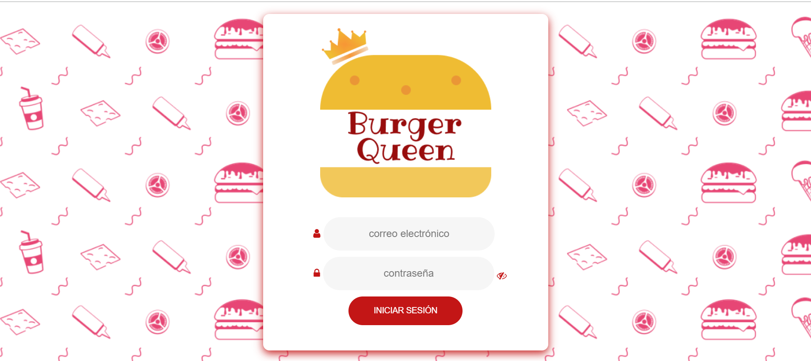

### Home - Adimistrador

#### Crear usuarios

Solo el administrador puede crear usuarios y asignar un rol.

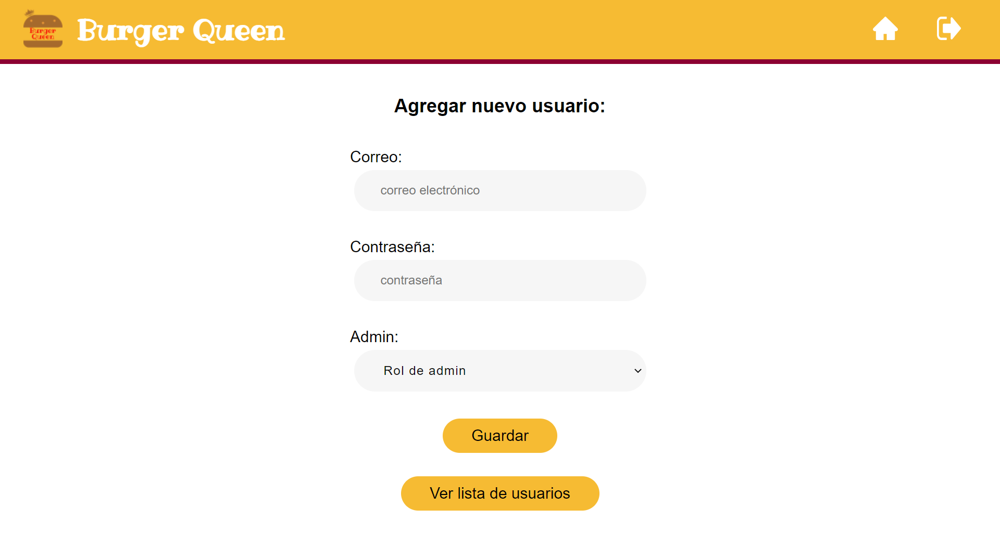

#### Lista de usuarios

En esta seccion el administrador podra actualizar el correo o eliminar un usuario.

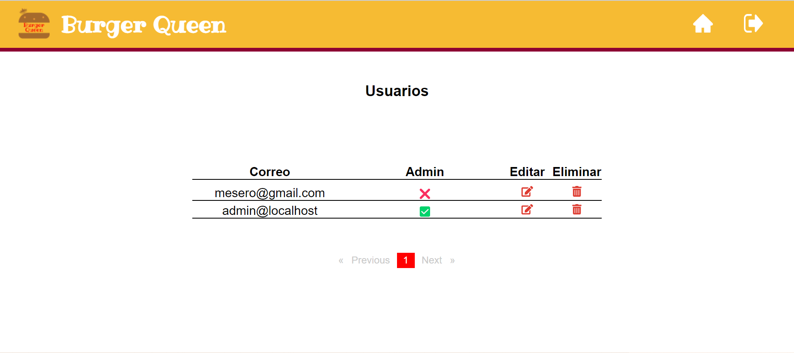

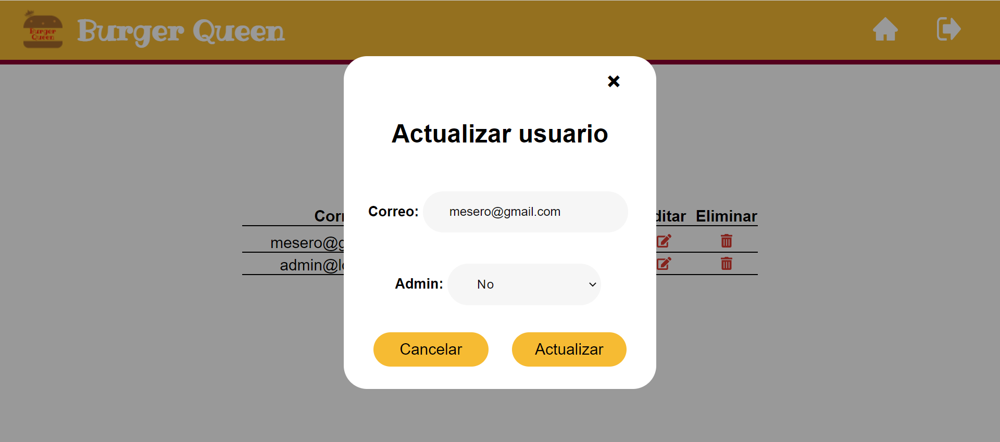

#### Lista de productos

En el apartado de lista de productos podremos ver todos los productos que han sido creados, tambien se puede editar y eliminar.

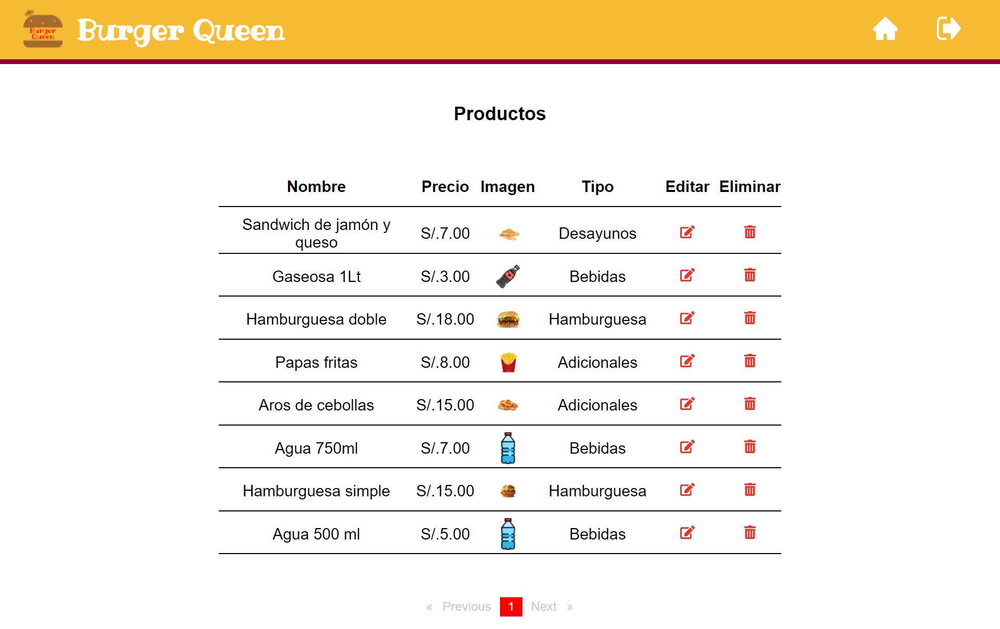

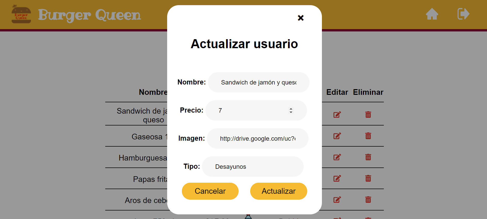

### Home - Staff

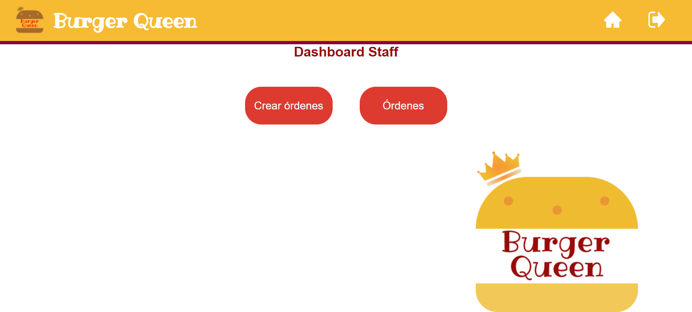

#### Crear ordenes

Al hacer click en `+` se agrega al listado de orden.
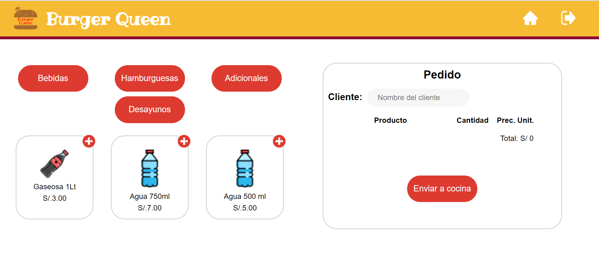

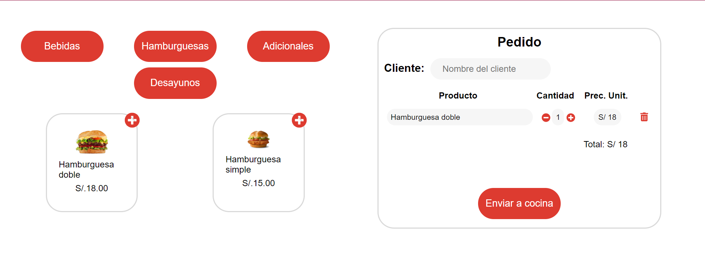

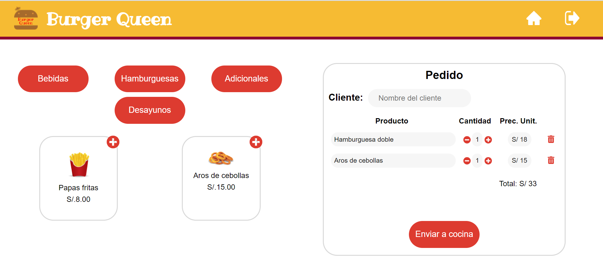

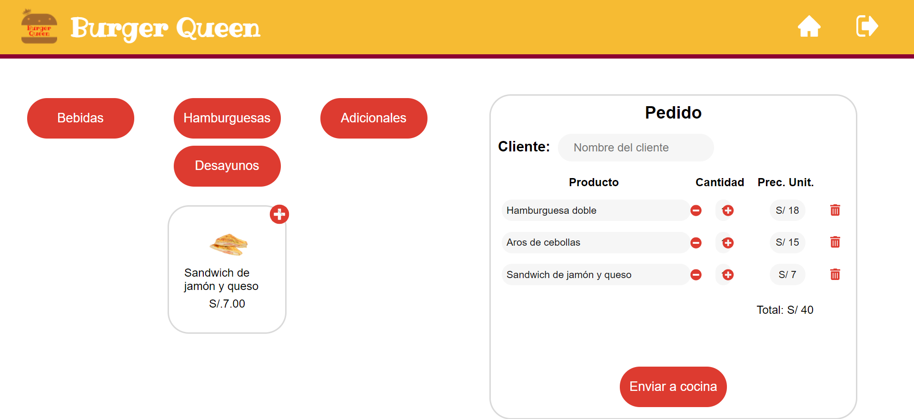

#### Listado de ordenes segun estado

En esta seccion las ordenes se filtran segun el estado de la orden.

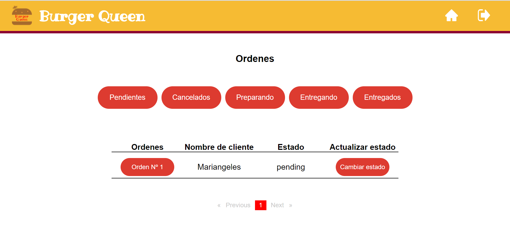

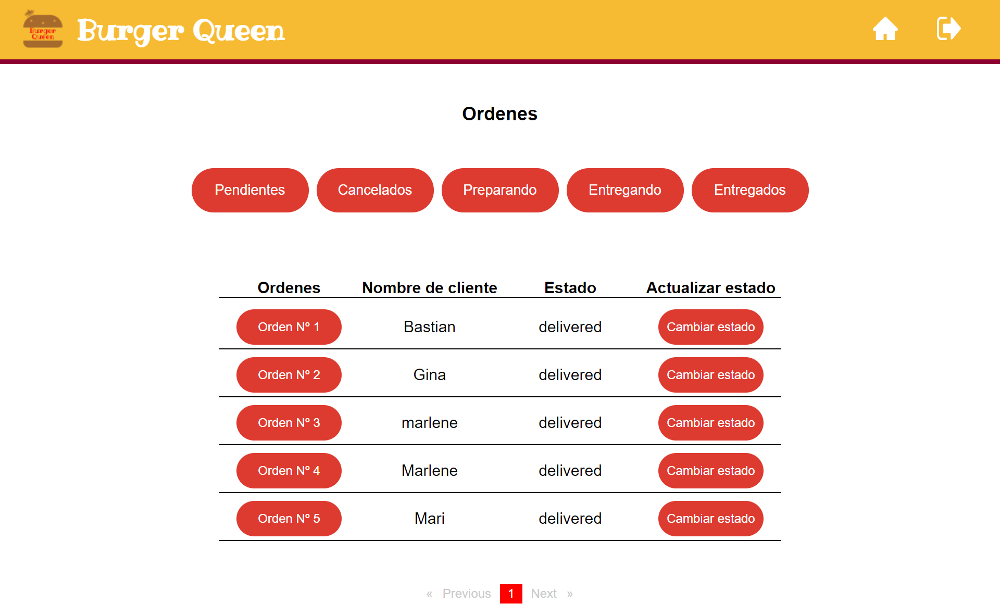

## Construido con 👩‍💻

- Angular 12.
- CSS.
- Burger queen API (creacion propia).
- Maquetado en Figma.
